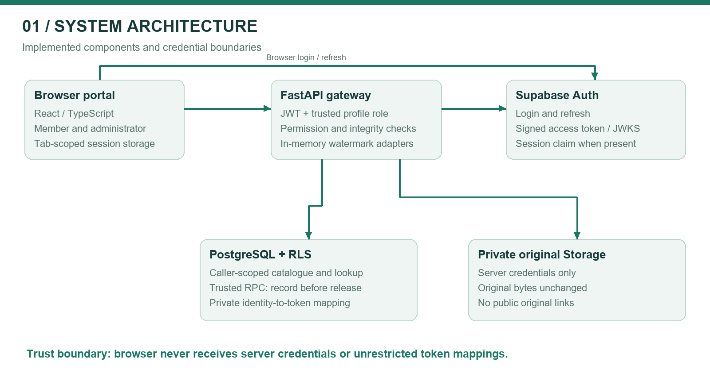
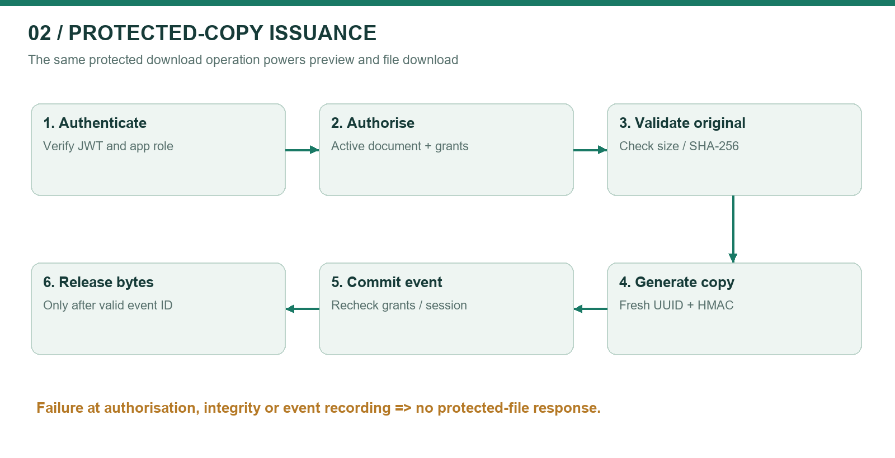
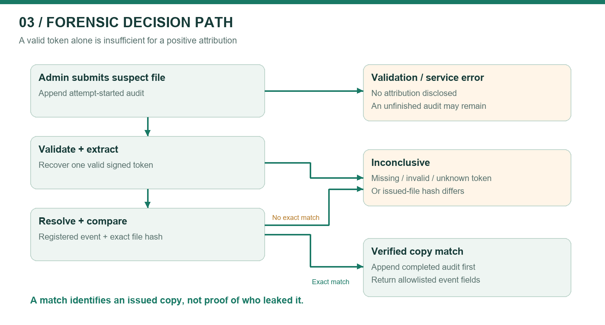
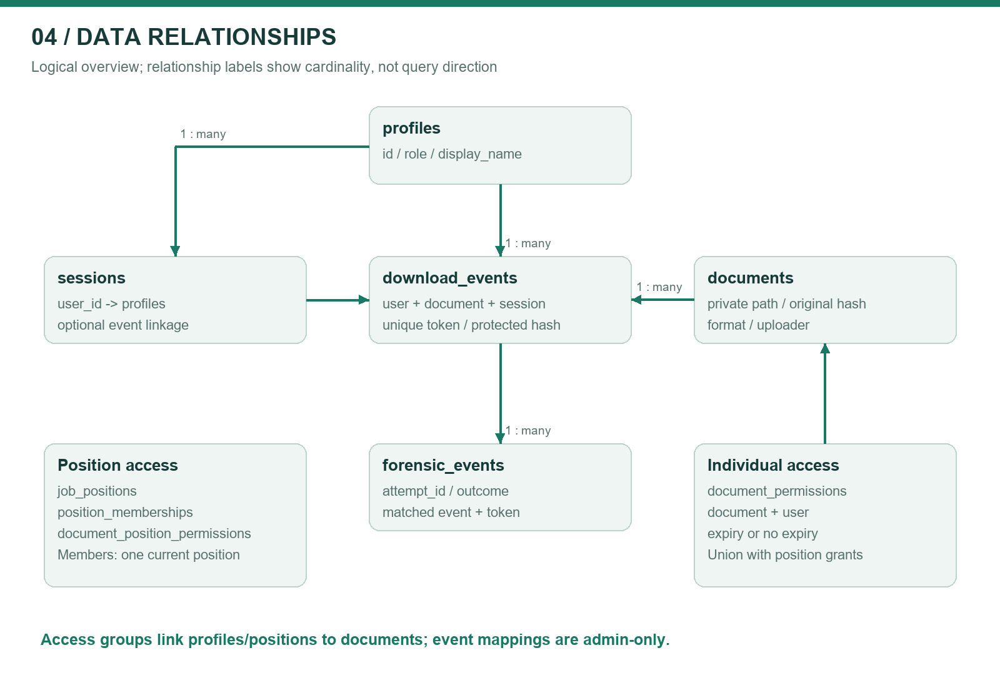
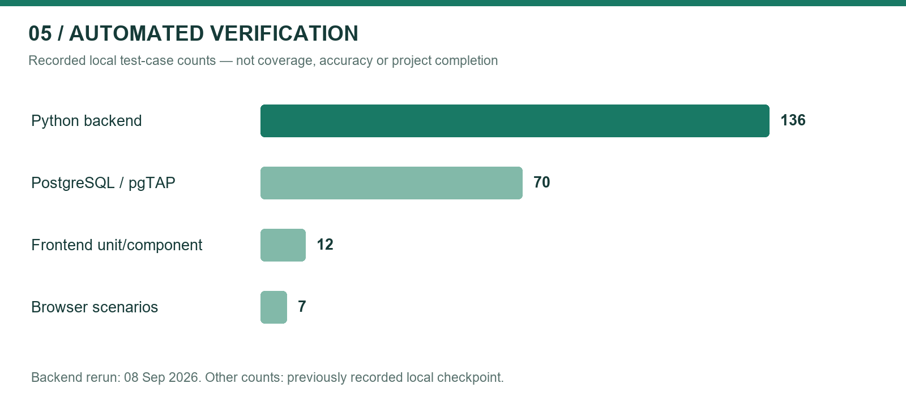
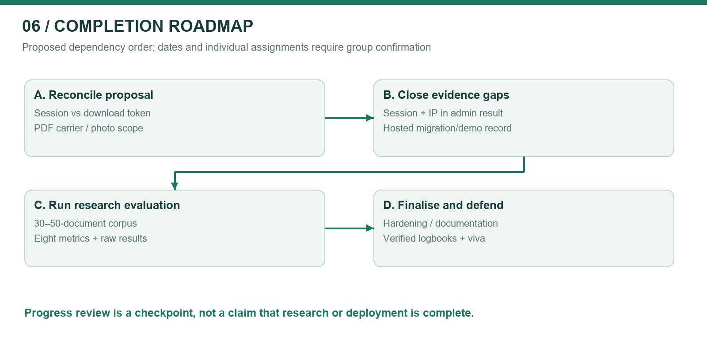

# STEGASHIELD GATEWAY
## Software Stack Specification and Group Progress Report

Group 60 | Information Security Project | Progress checkpoint: 08 September 2026

BSc (Hons) in Information Technology, specialising in Cyber Security
Department of Information Technology | Sri Lanka Institute of Information Technology

Session-authenticated document distribution with signed per-download watermarking and controlled forensic attribution.

| Group member | Student ID | Proposal responsibility |
|---|---|---|
| Nethmika J.A.M. | IT23817258 | Secure session-based authentication gateway |
| K.K.R.L. Madhushani | IT23840546 | Zero-width character text steganography |
| L.P.M.S. Prasanna | IT23638136 | Secure audit database design |
| Liyanamana M. | IT24569072 | Forensic extraction portal |

Supervisor: [Confirm name] | Submission date: [Confirm] | Version 1.0 — progress review draft

Document control: Prepared from the Group 60 proposal, the current local implementation, and recorded test results. Member ownership above is the proposal allocation, not proof of individual authorship. Each member must verify their contribution records before submission. No supervisor approval or signature is implied.

## Executive summary

StegaShield Gateway investigates post-download accountability for sensitive digital documents issued to authorised users. Instead of embedding a person's name or IP address, the gateway embeds an anonymous identifier and keeps the identity mapping in a protected server-side database. An administrator can examine a recovered file and determine whether it exactly matches a copy issued by the gateway.

The current prototype integrates a React/TypeScript portal, FastAPI services, Supabase authentication, PostgreSQL Row-Level Security (RLS), private original storage, DOCX watermarking, an opt-in experimental PDF adapter, and an audited forensic interface. Individual and job-position access controls and protected-copy previews extend the proposal's core workflow. Sessions now survive page refresh within the same browser tab.

This is an implemented and locally tested prototype, not a completed research evaluation or a production-certified service. The latest backend rerun on 08 September 2026 passed 136 tests. The previously recorded local checkpoint passed 70 PostgreSQL tests, 12 frontend tests, seven browser tests, and the frontend build. These are software verification counts, not extraction accuracy percentages or proof of exhaustive security. Hosted operation has been reported as working by the project user, but a signed-off deployment test record has not been supplied.

Three decisions require explicit academic review. First, the implementation embeds a fresh signed download token rather than reusing the login Session ID. Second, PDF uses non-rendering page-content metadata rather than the same text-stream carrier as DOCX. Third, positive forensic attribution requires both a valid signed token and the exact issued file's SHA-256 hash. This reduces token-transplant misattribution but makes modified files inconclusive even when a token survives. These are disclosed refinements and limitations, not silently claimed proposal compliance.

The next milestone is to reconcile these decisions with the supervisor, complete the proposed 30–50-document evaluation, expose the missing administrator-only session/IP evidence safely, and capture hosted demonstration evidence. A progress assessment can fairly recognise the integrated implementation while recording these remaining research and deployment obligations.

## 1. Introduction and research gap

### 1.1 Purpose and audience

This report combines a software stack specification with an evidence-led account of Group 60's development progress. It supports supervisor review, individual component assessment, integration testing, and planning of the remaining work. Evaluators should read the executive summary, the proposal traceability matrix, and the evaluation plan first. Developers should use the interface inventory, data model, threat analysis, and release checklist.

ISP-04.pdf is a structural example from a different QR-payment project. Its useful elements are numbered requirements, stimulus/response descriptions, interface specifications, non-functional requirements, individual logbooks, and references. Its payment features, identities, dates, and hours are not StegaShield requirements and have not been copied. The supplied document is not a marking rubric; no exact mark allocation or guaranteed grade can be inferred from it.

### 1.2 Problem statement

An authorised user can receive a legitimate digital document and later redistribute it outside the issuing system. Access logs alone show who accessed the system, but may not distinguish which issued copy corresponds to a recovered file. StegaShield asks whether invisible marking plus protected server-side evidence can connect an online-shared file to its originating download without placing raw personal data inside it. This follows the proposal's research question in Section 1.3 [P1].

The project complements access control and DLP; it does not replace them. It does not automatically search email, messaging services, or the public internet for leaks. An administrator must obtain and submit the suspect file. The proposal's absolute assertion that no existing approach combines these ideas requires a stronger, verified literature review before it is repeated as a novelty claim. This report therefore frames the contribution as an integrated, evaluable academic prototype rather than an established first-of-its-kind invention.

### 1.3 Scope

In scope: browser-based authenticated access; controlled DOCX and static PDF distribution; anonymous per-copy marking; private original storage; role-restricted lookup; audit records; individual/position access; previews of protected copies; and systematic digital-file evaluation.

Outside the stated proposal scope: physical printouts, photographs, screenshots, endpoint agents, preventing all redistribution, and proving the human perpetrator from a matched file alone. The proposal explicitly excludes photographed or printed content in its abstract and Section 1.4. Its later DCT/OCR technology rows conflict with this scope and must be clarified, not treated as automatically required missing features.

## 2. Proposal alignment and change control

Status terms: Implemented = code exists and relevant automated checks exist; Partial = an important part or evidence is missing; Experimental = implemented with limited validation; Planned = not demonstrated; Clarification = proposal wording and implementation differ. No aggregate completion percentage is assigned because requirements have unequal effort and risk.

| ID / proposal basis | Current position | Status | Action or evidence needed |
|---|---|---|---|
| P-01: secure authentication, Sections 2.2/3.8 | Supabase Auth; JWT signature, issuer, audience and expiry checks; database-derived app role | Implemented | Capture real-account login, expiry and rejection evidence |
| P-02: generate a Session ID at each login, Sections 3.1/3.8 | Uses verified Supabase session_id when present; local session row created on download, not every login; missing session_id is accepted | Partial / clarification | Decide whether mandatory session claims and login-time auditing are required |
| P-03: invisible ID at download, Sections 2.2/3.8 | Signed random UUID per download; DOCX zero-width carrier | Implemented refinement | Approve terminology: session-linked per-download token |
| P-04: selected digital formats, Section 1.4 | DOCX plus opt-in static PDF | DOCX implemented; PDF experimental | Real-document compatibility corpus |
| P-05: secure sessions/documents/download_events, Sections 3.2/3.7 | PostgreSQL schema, RLS, append-only event protection, private originals | Implemented | Confirm hosted migration state and access checks |
| P-06: log identity, session, IP and time, Section 3.8 | User/time recorded; request IP when valid; optional verified session binding | Partial | Mandatory-session decision and trusted reverse-proxy IP configuration |
| P-07: separate administrator access, Section 3.8 | Same login provider; admin API dependency and DB role restrict forensic actions | Implemented role separation | Clarify if proposal means a separate login mechanism, which is not implemented |
| P-08: extract and resolve to user/session/IP/time, Section 3.8 | Match returns download ID, user ID, document ID and timestamp; session/IP are not selected or shown in lookup | Partial | Add authorised evidence fields and leakage tests |
| P-09: inconclusive without valid evidence, Section 3.8 | Missing, invalid, conflicting, unknown or changed-copy evidence does not reveal identity | Implemented | Quantify false-attribution behaviour across a corpus |
| P-10: no raw personal data in watermark, Sections 2.2/3.9 | Payload contains format marker, random UUID and HMAC tag | Implemented | Include payload inspection evidence |
| P-11: evaluate eight metrics, Sections 3.5/3.6 | Unit/integration checks and synthetic rendering comparisons exist | Partial | Controlled 30–50-document evaluation and measured results |
| P-12: transformations, Sections 3.5/3.6 | Some corruption/rewrite cases tested; exact-hash rule deliberately refuses changed-file attribution | Partial | Separate token survival from positive attribution measurements |
| P-13: visual stego / OCR rows, Section 3.3 | No DCT or OCR pipeline; proposal explicitly excludes photo/print path elsewhere | Clarification | Supervisor confirms removal or formally revised scope |
| E-01: job-position permissions | Dynamic position grants plus independent member grants | Implemented extension | Hosted grant/revoke demonstration |
| E-02: preview and refresh persistence | Recorded protected-copy preview; sessionStorage persistence | Implemented extension | Browser compatibility and accessibility review |

### 2.1 Architecture decisions requiring approval

ADR-01 — Per-download token versus login Session ID. A login session can issue several copies. A fresh UUID distinguishes each copy and can still refer to its authentication session through download_events.session_id. The HMAC authenticates the token. Retain this design; update the proposal description rather than weakening the implementation to reuse a session watermark.

ADR-02 — Integrity-gated attribution. HMAC authenticates the embedded identifier, not the complete document. A signed frame could be transplanted into another document. The stored SHA-256 comparison therefore remains necessary for the current positive-match policy. The tradeoff is lower attribution coverage after legitimate file transformations. Do not remove this check merely to produce better-looking robustness figures.

ADR-03 — PDF carrier and libraries. The implementation uses pypdf, not the proposed pikepdf. It inserts a non-rendering /StegaShield marked-content point carrying the signed frame. DOCX uses zero-width characters in text runs. Both share the identifier and signing codec, but their physical carriers and transformation behaviour differ. Present PDF as an experimental implementation adaptation.

ADR-04 — Scope inconsistency. Section 3.3 lists DCT visual watermarking and a Tesseract photo path, while Section 1.4 explicitly excludes such inputs. OCR of rendered text cannot reconstruct invisible Unicode characters that were never rendered. A physical-channel watermark would be a different research mechanism. Obtain a documented scope decision before adding it.

ADR-05 — Evidence privacy. The proposal sometimes implies all identity-resolving records are administrator-only. Current policies permit users to read their own profile and session rows; download-token mappings and forensic events remain administrator-only. Review this distinction with the supervisor and state it precisely.

## 3. Methodology and development progress

The proposal specifies design science research supported by iterative component development [P1, Sections 3.4–3.6]. The artefact is the gateway; the evaluation must determine its behaviour, not simply demonstrate a successful happy path.

The engineering sequence implemented the database and authentication boundary before protected DOCX delivery and forensic lookup. The portal followed the DOCX validation gate. PDF was then developed and tested independently before opt-in integration. Recent changes added position access, refresh persistence and protected previews. These are observed implementation checkpoints, not a reconstructed timesheet of individual labour.

| Component | Available implementation | Evidence anchor | Main remaining obligation |
|---|---|---|---|
| Authentication gateway | JWT/JWKS verification; app roles; session binding; refresh-safe UI | core/auth.py; tests/test_auth.py; browser refresh test | Login-time session semantics, expiry/revocation evidence |
| Watermark engine | Shared signed codec; DOCX adapter; static PDF adapter | watermarking/codec.py; test_docx_adapter.py; test_pdf_adapter.py | Representative corpus, transformed-file token survival |
| Audit database | RLS, private bucket policy, trusted download RPC, append-only events, position grants | supabase/migrations; supabase/tests | Hosted evidence, backup/retention, access-change audit |
| Forensic portal | Admin extraction, exact-copy check, started/completed audits, no suspect retention | api/v1/documents.py; frontend/src/App.tsx | Session/IP evidence fields and investigator usability |

## 4. Architecture and technical flow

The browser receives only public Supabase configuration and uses the user's access token. FastAPI validates that token and reads the user's application role. Metadata queries use caller-scoped credentials to preserve RLS. Server credentials are reserved for private storage operations, trusted download recording, and forensic audit writes. They must not appear in frontend bundles, screenshots, logs, or submitted evidence.

### 4.1 Protected download and preview

The API selects an active document visible to the principal, checks individual or position permission, validates the original's stored size/hash, and rejects an already marked source. It produces a new signed copy in memory. The database RPC rechecks active-document, permission and session conditions under row locks, then inserts the download event. Only a valid event acknowledgement permits release of bytes. Database failure therefore cannot be treated as a successful download. An event records issuance, not proof that the recipient finished receiving or opening the file.

Opening Preview invokes the same download endpoint. Saving from the preview saves that issued copy; clicking Download separately issues another token. No public original URL or third-party office viewer is introduced. The UI warns that rendered/copied text or screenshots do not retain the exact-copy attribution guarantee.

### 4.2 Forensic decision path

An administrator submits a suspect DOCX/PDF. The API appends an attempt-started event before parsing. It validates structure and extracts the signed token where recoverable. A valid token must resolve to exactly one download record, and the submitted file hash must equal the recorded protected hash. Only then is a completed matched event appended and the allowlisted result returned. Otherwise the outcome is inconclusive or a validation/service error. A lookup outage can leave an unfinished started record; a failed audit write blocks disclosure of a result.

A positive match means that the recovered bytes match an issued copy associated with an account. It does not establish intent, prove who physically leaked it, exclude compromised credentials, or establish a legal chain of custody by itself.

### 4.3 Token construction

The codec constructs a 35-byte value: three-byte marker SS1, a 16-byte UUID, and a 16-byte truncated HMAC-SHA256 tag. Four zero-width symbols encode two bits per symbol: U+200B, U+200C, U+200D and U+2060. The encoded body therefore uses 140 symbols, with five-character start and end delimiters. Signature comparison uses constant-time comparison. The secret must be at least 32 bytes; production use requires independently generated secret material.

The signature is a symmetric message-authentication code, not a public-key document signature and not encryption. People with database or signing-key privileges remain inside the trust boundary. Key rotation with historical verification keys has not been demonstrated.

## 5. Software stack and interfaces

| Layer | Implemented technology | Role / rationale | Qualification |
|---|---|---|---|
| Web portal | React, TypeScript, Vite, Tailwind CSS | Typed member/admin UI with responsive components | Browser verification is local, not a complete accessibility audit |
| API | Python, FastAPI 0.116.1, Uvicorn 0.35.0 | Validation, authenticated routes, file streaming | Hosted hardening and rate limits remain |
| Configuration | pydantic-settings 2.10.1 | Environment validation and configuration | Never attach actual .env |
| Authentication | Supabase Auth; PyJWT 2.10.1 | JWT/JWKS verification and role resolution | Accepts ES256/RS256; session_id currently optional |
| DOCX | python-docx 1.2.0; custom signed codec | In-memory text carrier and extraction | Text transformation can strip markers |
| PDF | pypdf 6.17.0 | Static PDF parsing and non-rendering carrier | Experimental; differs from proposed pikepdf |
| PDF evaluation | pypdfium2 5.13.0 | Independent renderer for fixture comparison | Test renderer, not a photo/OCR pipeline |
| Database/storage | Supabase PostgreSQL, RLS, private Storage | Metadata, mappings, originals and audit | Service credentials bypass RLS and require strict server scoping |
| DOCX preview | docx-preview | Browser rendering in script-disabled frame | HTML alt-chunks disabled; restrictive CSP |
| Verification | pytest, pgTAP, Vitest, Playwright | Unit, API, SQL policy and browser checks | Counts are not coverage percentages |

Versions above are pinned backend dependency declarations. Frontend manifests use version ranges and a lockfile; preserve the lockfile when reproducing a build. Pillow used to produce this report's figures is a documentation tool, not evidence that the proposal's DCT watermarking stack exists.

### 5.1 API inventory

| Interface | Access | Purpose |
|---|---|---|
| GET /api/v1/auth/config | Public | Allowlisted URL, publishable key and supported formats |
| GET /api/v1/auth/me | Authenticated | Verified user ID and application role |
| GET /api/v1/documents | Authenticated/RLS | List permitted active supported documents |
| POST /api/v1/documents | Admin | Validate and upload an unmarked original |
| POST /api/v1/documents/{id}/download | Permitted user/admin | Generate, record and return protected copy |
| GET/POST/DELETE document permission routes | Admin | Manage individual or position grants |
| Admin positions/membership routes | Admin | Create positions and assign/remove members |
| POST /api/v1/forensics/{format} | Admin | Audited extraction and exact-copy resolution |
| GET /api/v1/admin/forensic-events | Admin | Recent started/completed investigation records |

Local development uses FastAPI on port 8000 and Vite on 5173. Production requires HTTPS and a documented reverse-proxy configuration. No special end-user hardware or endpoint agent is required. Browser PDF support varies. Account provisioning currently occurs outside the portal; self-registration and password recovery screens are not implemented.

## 6. Data design and permission model

| Entity | Important fields / purpose | Access boundary |
|---|---|---|
| profiles | id, display_name, role | Self/admin read; admin modification |
| sessions | id, user_id, start/end, IP, user agent | Self/admin read; trusted recording |
| documents | id, format, private path, original hash, size, uploader | Permitted reads; admin catalogue changes |
| document_permissions | document_id + user_id, expiry | Own/admin reads; admin grants |
| job_positions | id, name | Admin-managed directory |
| position_memberships | user_id primary key, position_id | One position per member; admin-managed |
| document_position_permissions | document_id + position_id, granted_by | Dynamic position grants; admin-managed |
| download_events | token, document/user/session, protected hash, time/IP | Admin mapping reads; server inserts; append-only protections |
| forensic_events | attempt_id, completed, outcome, reason, matched event | Admin reads; server inserts; append-only protections |

Effective access is the union of a valid individual grant and a current position grant, with the existing administrator override. Removing one source does not negate the other. Members cannot assign themselves to a position. The trusted RPC repeats permission checks at issuance so stale UI or API reads cannot authorise a revoked grant. Original storage remains server-only even when an unrelated permissive storage policy exists.

The database uses a composite relationship between a matched event and token to constrain inconsistent forensic mappings. Original metadata is protected against mutation. These controls do not make database-superuser activity impossible or create an externally notarised audit trail. Permission and membership changes do not yet have a dedicated append-only history and should be added for stronger administrative accountability.

## 7. Functional requirements and acceptance scenarios

| ID | Requirement | Stimulus and expected response | Current evidence |
|---|---|---|---|
| FR-01 | Authenticate before document access | Missing/invalid token → denied; valid principal → RLS-scoped catalogue | Auth/API tests |
| FR-02 | Derive roles from trusted data | User-supplied admin metadata → no privilege elevation | Auth/RLS tests |
| FR-03 | Preserve login across refresh | Refresh same tab → restore session and recheck identity; sign-out then refresh → login | Browser test |
| FR-04 | Accept only supported valid originals | Invalid/oversized/premarked upload → error before storage | DOCX/PDF workflow tests |
| FR-05 | Support member and position permissions | Admin grants access → future permitted requests succeed; revoke effective grant → denied | API, SQL and browser tests |
| FR-06 | Issue a fresh watermark per request | Download twice → distinct protected bytes/tokens and separate records | Workflow/codec tests |
| FR-07 | Record before returning bytes | Download-record failure → no protected-file response | Workflow tests |
| FR-08 | Keep originals private and unchanged | Direct client storage request → denied; generation → in-memory copy | RLS/integrity tests |
| FR-09 | Preview only protected copies | Preview click → POST download and record; close → object URL released | Browser preview test |
| FR-10 | Restrict forensic analysis to admins | Member suspect upload → 403; admin → audited attempt | API tests |
| FR-11 | Refuse weak attribution | Wrong key, unknown/conflicting token or different hash → no identity match | Adapter/workflow tests |
| FR-12 | Show complete proposed evidence | Match → user, session, IP, timestamp with appropriate privacy controls | Partial: session/IP display missing |
| FR-13 | Keep suspect content transient | Investigation → audit metadata, not retained suspect file | Implementation inspection |
| FR-14 | Evaluate proposal metrics | Reproducible corpus run → raw measurements and analysis | Planned research deliverable |

### 7.1 Example assessor demonstration

Use synthetic documents and designated test accounts. An admin uploads an original and grants Member A access. Member B must not see/download it. A downloads twice; an admin investigates the first unchanged copy and obtains its associated event. Investigating the original yields inconclusive. A modified copy must not falsely identify another user. Revoke A's effective grant and attempt a new download. Repeat via a job-position grant, then show refresh persistence and a protected preview. If PDF is enabled, repeat with a supported static PDF. Record actual responses and redact credentials. Do not describe browser mocks as a live Supabase demonstration.

## 8. Non-functional requirements and security practices

| Area | Current control | Remaining measurable acceptance criterion |
|---|---|---|
| Confidentiality | RLS, admin-only mappings, server-only originals | Hosted direct-access negative tests; review logs and frontend bundles |
| Integrity | HMAC token; original and protected SHA-256; append-only event protections | Tampering/transplant corpus; backup and privileged-change review |
| Privacy | No raw identity in payload; no retained suspect files | Data-retention schedule, minimisation review, investigator access policy |
| Reliability | Record acknowledgement before bytes; forensic started/completed entries | Failure injection, network interruption and restore tests |
| Performance | Bounded upload and parsing checks | Measure p50/p95 latency and peak memory by size/format; targets must be agreed |
| Usability | Responsive UI, focus states, native modal and previews | Keyboard, screen-reader and browser task testing |
| Availability | Local demo and hosted dependencies | Document uptime window, deployment procedure and recovery drill |
| Scalability | Indexed relational schema; bounded list queries | Pagination and controlled concurrency/load evaluation |

The implementation adopts practices consistent with JWT algorithm/issuer/audience verification guidance [R1], explicit authorisation checks and deny-by-default access [R2], and Supabase's separation of caller RLS context from privileged service credentials [R3]. These are practice mappings, not a claim of OWASP certification, ISO compliance, legal compliance, or a completed penetration test.

Known operational limitations include in-process parsing without hard worker isolation, no demonstrated rate-limiting layer, tab storage exposed to same-origin JavaScript, no verified secret-rotation workflow, and no tested restore procedure. PDF checks bound selected structures and reject selected active content but are not a complete malware scanner. Production public upload processing needs isolated workers with hard CPU/memory/time limits.

## 9. Threat model and residual risks

| Threat | Boundary/control | Residual risk or next step |
|---|---|---|
| Client impersonates another user | Verified JWT principal; body identity ignored | Compromised account/token remains a valid principal until invalidated |
| Member escalates role/position | Database role and admin-only position RLS | Privileged admin misuse requires monitoring/history |
| Signed frame transplanted to unrelated file | Exact protected SHA-256 check | Modified genuine files lose positive-attribution coverage |
| Attacker strips/reformats watermark | Inconclusive rather than guessed identity | No guarantee of marker survival; measure transformations |
| Direct original download | Private bucket and restrictive client policy | Server credential compromise bypasses client protections |
| Malformed/expanding document | Size/structure limits; supported formats only | Hard process limits and broader malicious corpus still needed |
| Database outage during issuance | RPC acknowledgement required before bytes | Successful commit followed by lost response can still create an issued event |
| Audit outage during investigation | Audit-before-result | Availability loss and unfinished attempts require operational review |
| Session theft through XSS | Isolated preview, no raw HTML alt-chunks; tab persistence | Not an HttpOnly-cookie architecture; broader XSS review remains |
| Misleading IP evidence | Records observed request client IP | Reverse proxy/NAT can obscure origin; do not treat IP as proof of identity |

## 10. Verification evidence and evaluation design

| Suite | Passed count | Evidence qualification |
|---|---|---|
| Python backend | 136 | Rerun on 08 September 2026; one dependency deprecation warning |
| PostgreSQL / pgTAP | 70 | Prior recorded local checkpoint; not hosted database testing |
| Frontend unit/component | 12 | Prior recorded checkpoint; repeat before submission |
| Browser scenarios | 7 | Prior recorded checkpoint using Edge and explicit HTTP fixtures |
| Frontend build | Pass | Compilation/bundling evidence, not a runtime security test |

The suites cover authentication, role boundaries, caller-scoped requests, permitted downloads, database failures, original integrity, signed token handling, conservative matching, PDF rendering fixtures, session binding, position access and browser interaction. The PDF adapter includes independent 144-DPI pixel comparisons on generated text/image/rotation/crop fixtures. This must not be generalised into a claim of pixel-identical output for all PDFs or DOCX applications.

### 10.1 Dataset protocol

Prepare 40 synthetic or permission-cleared originals as a working target within the proposal's 30–50-document range: 20 DOCX and 20 supported PDFs, distributed across short/medium/long documents and text, tables, images, multilingual content and layout variation. Record exact counts after collection rather than presenting this target as an existing dataset. Keep malformed, encrypted and intentionally unsupported files in a separate rejection corpus so they do not distort extraction denominators.

For each supported original, create at least two issued copies for controlled accounts. Retain a manifest with dataset ID, format, pages, bytes, original hash, protected hash, expected token/event, operation, application/version, and outcome. Keep identifying mappings in controlled evaluation storage. Test unchanged files, application re-save, copy-paste, partial excerpts and supported conversion paths. Do not include photos as an expected successful channel; they may be demonstrated only as a documented negative control.

### 10.2 Eight proposal metrics

| Proposal metric | Operational definition | Reporting requirement |
|---|---|---|
| Session uniqueness | Duplicate session identifiers / generated authenticated sessions | Also report download-token uniqueness separately |
| Invisibility | Text/layout comparison and rendered pixel differences | Name renderer, resolution and document class |
| Extraction accuracy | Correct tokens recovered / eligible marked inputs | Separate unchanged and each transformation |
| Robustness | Correct tokens recovered after operation / transformed inputs | Report per operation, format and application |
| Performance | Wall-clock embed/extract/API latency, memory | Repetitions, warm/cold distinction, median/p95, hardware |
| Database security | Denied unauthorised cases / attempted negative cases | Enumerate scenarios; no exhaustive-security inference |
| Attribution accuracy | Correct positive mappings / eligible issued-file cases | Report inconclusive rate separately |
| False attribution | Incorrect positive mappings / negative-control cases | State denominator and uncertainty even when zero observed |

Token extraction and positive forensic attribution are different measurements. An edited file can retain a valid token yet remain inconclusive under the exact-hash policy. Present both results. Do not label all inconclusive transformed files as signature failures. No measured research percentages or processing-time curves are available in this report; inserting attractive fabricated graphs would undermine the assessment.

Planned result visuals: grouped bars for token recovery by transformation/format; latency-versus-size scatter plots with median/p95 summaries; a matched/inconclusive/wrong-match matrix; and a corpus composition chart. Populate only from the saved manifest/results. The supplied test-count chart is descriptive verification evidence, not one of these missing research results.

## 11. Remaining work and milestone plan

| Priority | Work package | Proposed lead from component allocation | Exit evidence |
|---|---|---|---|
| P0 | Approve session-token terminology, PDF carrier and DCT/OCR scope | All members + supervisor | Dated change decision, no forged approval |
| P0 | Verify hosted migrations and real-account workflows | Database + gateway leads | Redacted migration status and signed-off scenario sheet |
| P0 | Add administrator-only session/IP evidence and decide mandatory session claim | Gateway + forensic leads | API/UI fields, authorisation tests, sample evidence |
| P0 | Complete 30–50-document evaluation and raw result files | Watermark lead + all members | Reproducible runner, manifest, charts, limitations analysis |
| P1 | Harden untrusted parsing, rate limits, secrets and proxy configuration | Gateway + database leads | Resource limits, deployment checklist, negative tests |
| P1 | Add grant/membership change audit and tested retention/backup policy | Database lead | Migration/tests, restore record, retention decision |
| P1 | Validate browser PDF preview, accessibility and large-list pagination | Forensic/frontend lead | Browser/task matrix, resolved issues |
| P0 | Verify bibliography, contribution logs and final demonstration | All members | Source-checked references, truthful logbooks, demo recording |

Planning window: align the remaining September/October work with Appendix A of the proposal; exact deadlines need supervisor confirmation. Use dependency gates rather than declaring arbitrary percentage completion. Deployment hardening and evaluation should not be traded for extra cosmetic features while core proposal evidence is incomplete.

The proposal estimates LKR 0 under open-source/student-resource assumptions. This is an estimate, not verified expenditure. Record actual hosting, domain, storage and backup costs if incurred. The proposal mentions GitHub collaboration, but the inspected workspace did not expose Git history; individual contribution verification needs repository links, issues, dated artefacts or other genuine records.

## 12. Individual component reports and logbook templates

These sections preserve the four proposal responsibilities. Available group artefacts are suggested evidence for review; they are not statements that a particular person authored every listed file. Do not fill hours or meeting dates by inference. Each member should explain what they personally implemented, what they learned, what failed, and how their component integrates with the others.

### 12.1 Nethmika J.A.M. — IT23817258

Proposed component: secure session-based authentication gateway. Relevant artefacts include core/auth.py, JWT validation tests, the session-bound download RPC, and browser refresh/sign-out tests. Discussion points: distinction between authentication session and download token; signature/issuer/audience checks; server-derived roles; tab persistence; optional session_id and login-time audit gap. Next tasks: confirm session requirements and capture deployed expiry/revocation/IP behaviour.

| Date | Personal activity and decision | Evidence reference | Hours | Outcome / reviewer |
|---|---|---|---|---|
| [Actual date] | [Describe personally completed gateway work] | [File/test/commit] | [Actual] | [Verified outcome] |
| [Actual date] | [Describe personal testing or integration work] | [Evidence] | [Actual] | [Verified outcome] |

### 12.2 K.K.R.L. Madhushani — IT23840546

Proposed component: zero-width character text steganography. Relevant artefacts include the signed codec, DOCX/PDF adapters, round-trip/invalid-token tests and PDF pixel comparisons. Discussion points: two-bit symbol encoding; HMAC versus encryption; repeated frames; conflicting tokens; carrier differences; why extraction survival is not equivalent to trustworthy attribution. Next tasks: lead corpus construction, transformation tests and performance/invisibility analysis.

| Date | Personal activity and decision | Evidence reference | Hours | Outcome / reviewer |
|---|---|---|---|---|
| [Actual date] | [Describe personally completed watermark work] | [File/test/commit] | [Actual] | [Verified outcome] |
| [Actual date] | [Describe personal experiment and result] | [Raw results] | [Actual] | [Verified outcome] |

### 12.3 L.P.M.S. Prasanna — IT23638136

Proposed component: secure audit database design. Relevant artefacts include schema migrations, RLS policies, private bucket protection, append-only triggers, session binding and position-access SQL tests. Discussion points: client versus service credentials; grant union semantics; commit-time checks; record immutability and its privileged-user limits. Next tasks: hosted evidence, membership-change history, retention/backup and restore validation.

| Date | Personal activity and decision | Evidence reference | Hours | Outcome / reviewer |
|---|---|---|---|---|
| [Actual date] | [Describe personally completed database work] | [Migration/test/commit] | [Actual] | [Verified outcome] |
| [Actual date] | [Describe personal policy/restore testing] | [Evidence] | [Actual] | [Verified outcome] |

### 12.4 Liyanamana M. — IT24569072

Proposed component: forensic extraction portal. Relevant artefacts include admin lookup routes, the matched/inconclusive result interface, audit trail, previews and browser tests. Discussion points: exact-copy semantics; not accusing the person associated with an account; started/completed audit pairing; non-retention of suspect bytes; isolation of document rendering. Next tasks: display authorised session/IP evidence, investigate browser/accessibility issues, and prepare a redacted demonstration.

| Date | Personal activity and decision | Evidence reference | Hours | Outcome / reviewer |
|---|---|---|---|---|
| [Actual date] | [Describe personally completed portal work] | [File/test/commit] | [Actual] | [Verified outcome] |
| [Actual date] | [Describe personal usability/integration testing] | [Evidence] | [Actual] | [Verified outcome] |

## 13. Assessment evidence and submission checklist

| Review area from supplied assessment context | Where addressed | Evidence to attach |
|---|---|---|
| Introduction and gap | Section 1 | Verified literature comparison; restrained novelty claim |
| Methodology | Sections 3 and 10 | Design decisions, experiment protocol and raw data |
| Development progress | Sections 2 and 3 | Code anchors, test outputs, hosted screenshots |
| Technical flow and diagrams | Sections 4 and 6 | Architecture, issuance, forensic and data-model figures |
| Best practices and standards | Sections 8 and 9 | Control-to-test mapping; no unsupported compliance claim |
| Functional/non-functional requirements | Sections 7 and 8 | Acceptance cases and measured target decisions |
| Individual logbooks | Section 12 | Actual dates, hours and personal contribution evidence |

Before submission: confirm course/report title and any word/page limit; obtain the actual rubric; confirm names/IDs and supervisor details; verify proposal changes; update the table of contents/page numbers; add redacted hosted screenshots; replace all placeholders; verify every reference; and follow the institution's disclosure rules for AI-assisted writing and software. No report can guarantee full marks; assessors evaluate the evidence and the students' understanding as well as presentation quality.

Recommended screenshot set: member catalogue and denied access; admin original upload; individual and position grant panels; DOCX/PDF protected preview; exact-copy match; inconclusive original/modified file; forensic audit entries; and redacted passing test summaries. Label browser fixtures as fixtures, not deployment evidence.

## 14. Conclusion

Group 60 has an integrated prototype that demonstrates authenticated issuance of individually marked digital documents and conservative, administrator-restricted forensic lookup. The security-sensitive pipeline is stronger than a simple watermark demonstration because it combines signed identifiers, private originals, commit-time authorisation, event recording and exact-file verification. The project remains incomplete as a research deliverable until proposal adaptations are approved, missing forensic evidence fields and session semantics are resolved, and the proposed controlled evaluation is measured and documented. The appropriate progress claim is substantial implementation with clearly identified research and deployment work remaining.

## References and source notes

[P1] Group 60, StegaShield Gateway: A Session-Based Watermarking Web Gateway for Online Insider Threat Attribution, project proposal, SLIIT, August 2026. Supplied file: ISP_Project_Proposal .pdf, 31 PDF pages. Page references in this report use proposal section numbers to avoid front-matter pagination ambiguity.

[P2] Group ISP-04, A Two-Factor Authentication QR Payment System — Software Stack Specification, supplied example ISP-04.pdf, 25 PDF pages. Used only to understand report structure, not as a source of StegaShield functionality or a formal marking rubric.

[E1] Local StegaShield source, migrations and tests, inspected 08 September 2026. Key paths: backend/app/core/auth.py; services/gateway.py; api/v1/documents.py; api/v1/positions.py; watermarking/codec.py; docx_adapter.py; pdf_adapter.py; frontend/src; tests; supabase/tests. Paths are relative to stegashield-gateway.

[R1] IETF, RFC 8725: JSON Web Token Best Current Practices, February 2020. https://www.rfc-editor.org/rfc/rfc8725.html (accessed 08 September 2026).

[R2] OWASP, Authorization Cheat Sheet. https://cheatsheetseries.owasp.org/cheatsheets/Authorization_Cheat_Sheet.html (accessed 08 September 2026).

[R3] Supabase, Row Level Security. https://supabase.com/docs/guides/database/postgres/row-level-security (accessed 08 September 2026).

[R4] CISA, Insider Threat Mitigation Guide, November 2020, official resource listing: https://www.cisa.gov/topics/physical-security/insider-threat-mitigation/resources-and-tools (accessed 08 September 2026). Background reading, not proof of StegaShield's novelty.

Bibliography caution: the research papers listed in the proposal have not all been independently verified for author/title/venue/DOI accuracy. Do not reproduce them as verified references without locating the originals. Add a corrected literature-review appendix after that check.
